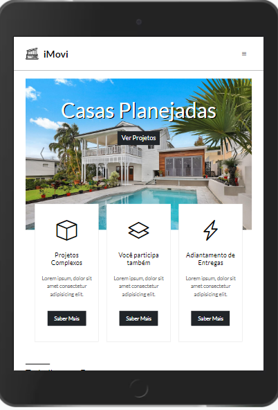
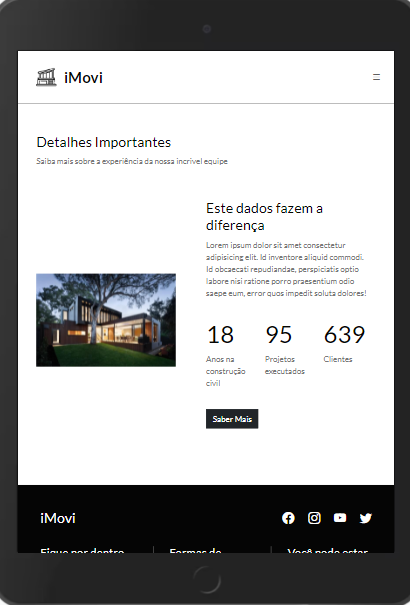
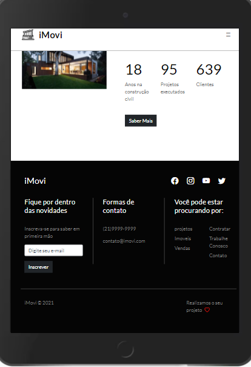

<h1 alinn="center">iMovi</h1>

Homepage de Imoveis https://imovi.netlify.app/

Sistema desenvolvido com HTML, CSS, JQuery e Bootstrap

Home

Projetos

Detalhes

Rodape

<h2>Contribuir</h2>
<ul>
  <li>Faça o fork do projeto (https://github.com/yourname/yourproject/fork)</li>
  <li>Crie uma branch para sua modificação (git checkout -b feature/fooBar)</li>
  <li>Faça o commit (git commit -am 'Add some fooBar')</li>
  <li>Push (git push origin feature/fooBar)</li>
  <li>Crie um novo Pull Request</li>
</ul>
